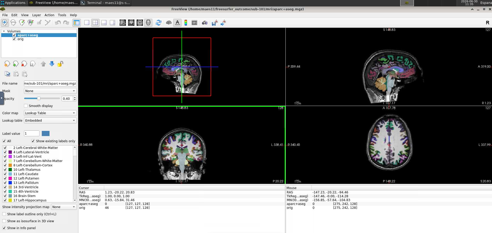
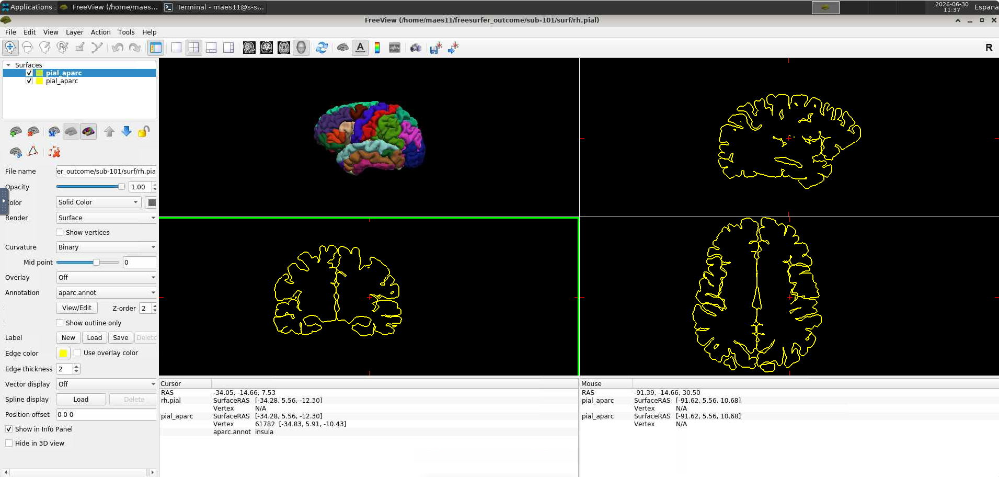

# Quality Control

In this step, distributions of each measure are assessed for normality and subjects are flagged as outliers based on their global and regional surface measures and sbTIV. Flagged subjects should be inspected visually to ensure acceptable data quality before submission to the consortium.

---

## Dependencies

Make sure the following are installed before running the QC scripts:

- FSL
- ImageMagick
- R with packages `ggplot2` and `Routliers`

To install the R packages:

```r
install.packages("ggplot2")
install.packages("https://cran.r-project.org/src/contrib/Archive/Routliers/Routliers_0.0.0.3.tar.gz",
  repos=NULL, type="source")
```

This page references five scripts. You only need to call two of them directly — `run_quality_control.sh` automatically runs `create_samseg_images.sh`, `create_histograms.R`, and `identify_outliers.R` internally. `inspect_subject.sh` is called separately and manually for each flagged subject in Step 4.

The following scripts must all be present in your `scripts/` folder:

- `run_quality_control.sh`
- `create_samseg_images.sh`
- `create_histograms.R`
- `identify_outliers.R`
- `inspect_subject.sh`

---

## Step 1 — Run QC Script

This step runs statistical outlier detection across all subjects and automatically generates diagnostic images for visual inspection. It compares each subject's surface measures and sbTIV against the distribution of the whole dataset to flag values that fall outside the expected range.

From the ENIGMA scripts directory, run:

```bash
bash scripts/run_quality_control.sh
```

This generates:

- `output/images/global_histograms/` and `output/images/regional_histograms/` — distribution plots
- `output/images/sbTIV/` — SAMSEG segmentation images
- `docs/Outliers.csv` — list of flagged subjects

---

## Step 2 — Inspect Histograms

This step checks that each measure follows a roughly normal distribution across your dataset, which is an important assumption for the statistical analyses in the mega-analysis. Deviations from normality, especially in small datasets, are common and not necessarily a sign of a problem — but worth checking.

For each measure and hemisphere, inspect the histograms in `output/images/global_histograms/` and `output/images/regional_histograms/` and check that distributions are approximately normal. Since some datasets may be small, use your discretion. Note that flagged outliers may appear in the histograms — these will be inspected in detail in Step 4.

---

## Step 3 — Inspect sbTIV Images

This step provides a visual check of the SAMSEG segmentation used to compute intracranial volume (sbTIV). Reviewing these images helps catch any major segmentation errors before the data is used in the analysis.

Inspect each image in `output/images/sbTIV/`. The left column shows the complete SAMSEG parcellation and the right column shows only the cortex segmentation. Check that the cortex has been adequately captured and that there are no major segmentation errors.

!!! tip
    Examples of acceptable segmentations and major errors can be found in the reference guide below:

    **[SAMSEG_QC_examples.pdf](../assets/SAMSEG_QC_examples.pdf)**

---

## Step 4 — Inspect Flagged Subjects

This step takes a closer look at any subject flagged as a statistical outlier in Step 1, to determine whether the flag reflects a genuine processing error or simply natural biological variation. This is the most important quality control step, as it directly determines whether a subject's data is reliable enough to include in the analysis.

For each subject listed in `docs/Outliers.csv`, inspect the data visually in FreeView:

```bash
bash scripts/inspect_subject.sh <subjectID> <QC-type>
```

Where `<QC-type>` is:

- `internal` — checks voxel-wise segmentation (recommended for thickness and volume outliers)
- `external` — checks surface-based parcellation (recommended for area outliers)

Below are example outputs:

!!! example "Internal QC view"
    

!!! example "External QC view"
    

!!! tip
    For an overview of error types, see the reference guide below (pages 4 and 6 onwards):

    **[ENIGMA_Cortical_QC_2.0.pdf](../assets/ENIGMA_Cortical_QC_2.0.pdf)**

!!! note "Please share your QC screenshots with us"
    For each flagged subject, please take a screenshot of both the `internal` and `external` FreeView windows and send them to us along with your final submission. This allows the analysis team to independently verify your QC decisions and helps us maintain consistent quality standards across all contributing sites.

---

## Step 5 — Record QC Decisions

This final step documents your quality control decisions so the analysis team knows exactly which subjects to include or exclude, and why.

After visual inspection, fill in the `QC_code` column in `docs/Outliers.csv` for each flagged subject:

| QC_code | When to use |
|---------|-------------|
| `OK` | No major error found — subject included despite being flagged |
| `Exclude` | Major segmentation or parcellation error found |

!!! note
    Being flagged as an outlier does **not** automatically mean exclusion. Only exclude subjects with clear segmentation or parcellation errors. When in doubt, contact Goretti or Claudia.

---

## Questions?

Do not hesitate to contact us if you have problems running the QC scripts or are unsure whether a subject should be excluded.

- **Goretti España-Irla** — goretti.espana@charite.de
- **Claudia Barth** — claudia.barth@charite.de
